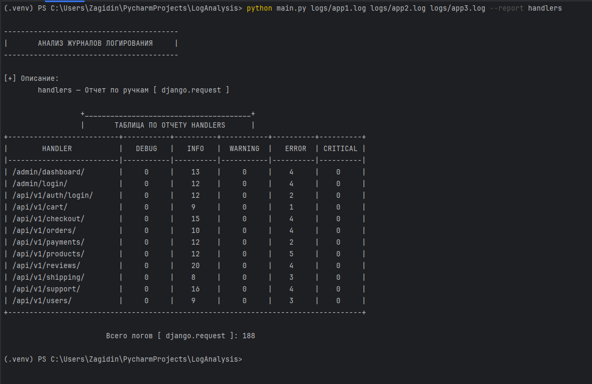

# Анализ журнала логирования

---

### Стек разработки CLI приложения
[](https://www.python.org/downloads/release/python-3100/) 

---

## Настройка проекта перед запуском
### 🚩 Создание и активация виртуального окружения 🚩

## Windows
```shell
  python -m venv .venv
```

```shell
  .venv/Scripts/activate
```

## Linux
```shell
  python3 -m venv .venv
```

```shell
  source .venv/bin/activate
```

---

## Установка нужных библиотек
```shell
   pip install -r requirements.txt
```

---

## 🚩 Запуск  🚩

## ⚡ Запустите файл `main.py` через терминал ⚡

</br>* <i><b>Windows</b></i> *
```shell
  python main.py -h
```

</br>* <i><b>Linux</b></i> *
```shell
  python3 main.py -h
```

---

## Создание отчета

Пример запуска создания отчета

```shell
    python3 main.py logs/app1.log --report handlers
```

---



---

[✨ Developer 2024 🎉](https://github.com/Zagidin)